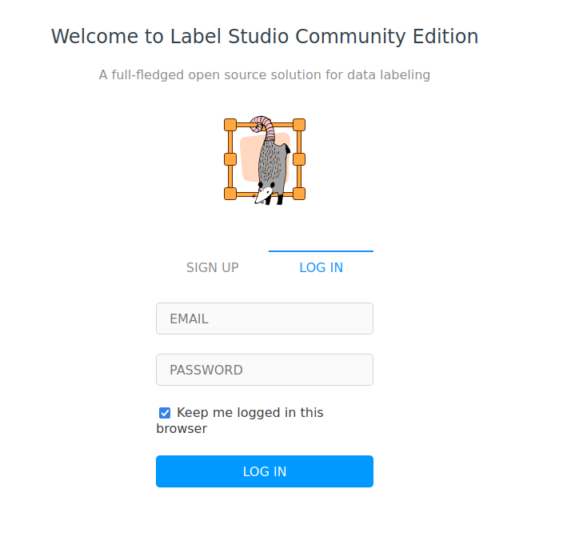
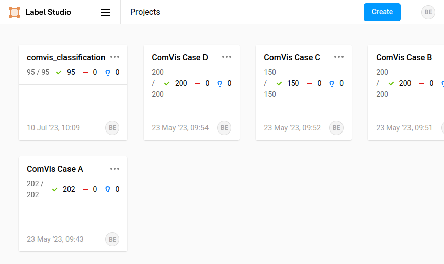
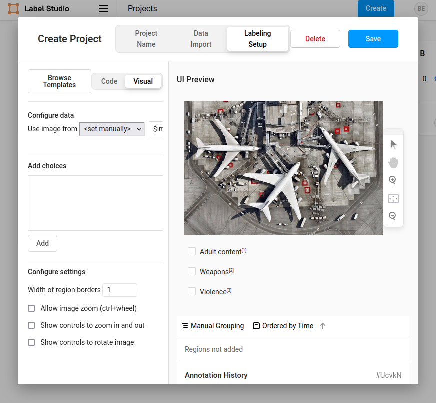
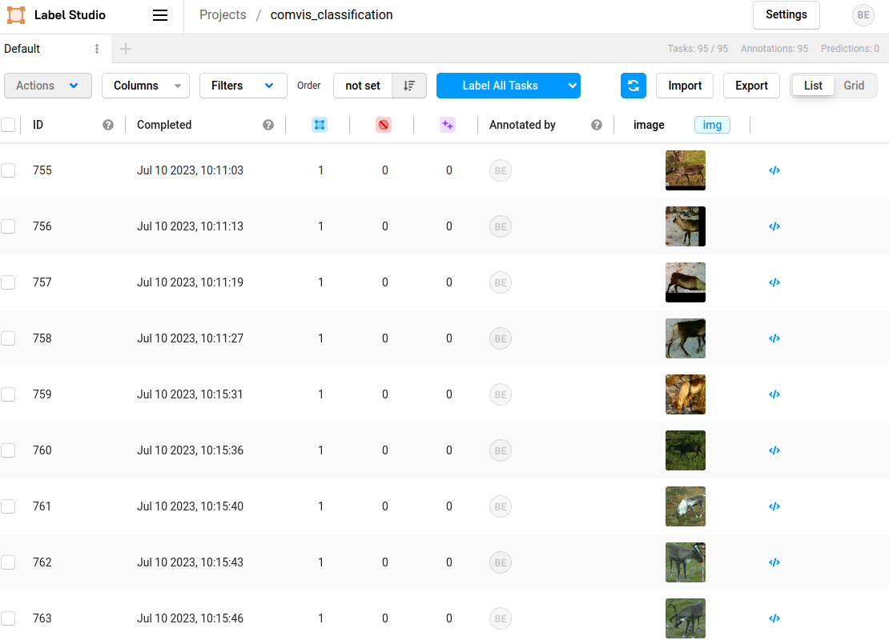

# Instructions for settin up a LabelStudio project

[LabelStudio] is an open source software for labelling all sort of data for training **machine learning algorithms**. 

## Accessing LabelStudio

An instance of LabelStudio has been deployed on a NINA server and can be accessed at [this link](http://nindocker02.nina.no:8180/user/login/).

## Desgin a labelling project

1- **Sign up**: To be able to login you first must make an account on LabelStudio

2- **Log in**: Once you have an account you can log in LabelStudio

3- **Create**: It is possible to create your project by clicking on ´Create´ in the top right corner of LabelStudio

4- **Setting specification**: 

    - *Project Name*: Fill in the project name and add a short description

    - *Data Import*: Drag and drop or browse the folder in which the pictures to label are located

    - *Labeling Setup*: Choose the labeling template you will be using. In most cases you will want to use the **Image classification template**

    - *Add choices*: Once the template is created add the labels you are going to use by clicking on the "Add" button

## Labelling

Now that the project is created it is possible to label the pictures. In LabelStudio main menu click on your project and begin the labelling process by clicking on the first picture.

Note that the labels are saved and it is possible to go back to labelling later on. This is especially useful for large tasks which might require days of labelling.

## Exporting the data

When the labelling is done for all the images it is possible to get the results by clicking on `export`. It is possible to export the results in different format such as `.json` or `.csv`.

Note that to train the custom model in `ComVis` the results need to be exported as a `.csv` file.

