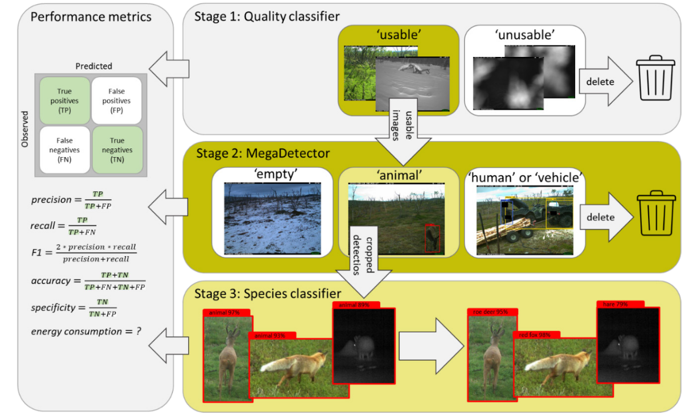

# ComVis: a cost-effective end-to-end pipeline for processing camera trap pictures at NINA

## Project ambition

The overall ambition of the Comvis project is to initiate a more efficient use of state-of-art machine learning tools, that will streamline the processing of camera-based monitoring data in NINA. We will achieve this by providing an end-to-end pipeline for processing of camera trap data based on a combination of an established model (MegaDetector) and customized classifiers trained on data from NINAs monitoring programs.

To test the various tools in the developed pipeline we have selected four real life cases which represent typical examples of how camera-based monitoring is used within NINA’s research and monitoring projects. They represent a range of habitat (terrestrial, coastal, marine), taxa (mammals, birds) and image acquisition modes (passive/active camera traps, motion trigger/timelapse) relevant to camera trap activities currently in NINA, as well as in the perceived methodological challenges involved in detecting animal objects in the images.

Table 1. Summary of the four cases selected as examples of camera-based monitoring designs employed in NINA. Image acquisition design is broadly characterized as either active or passive depending on the presence of bait which may actively attract animals to the trap, and motion or timelapse depending on whether or not the camera use a motion trigger, a timelapse trigger or both.

| Case | Target species | Bycatch species | Habitat | Image acquisition | Contact |
|-------|-----------------|---------------|---------|------------------|----------|
| **Case A: Forest ungulates**	| reindeer, moose	| hare, roe deer, sheep, fox, terrestrial birds	| birch forest	| passive, motion/timelapse	| Jane U. Jepsen |
| **Case B: Large predators**	| wolverine, white-tailed eagle, golden eagle |	raven, crow, stoat, weasel, pine marten, terrestrial birds	| birch forest, alpine	| active, motion/timelapse |	Jenny Stien |
| **Case C: Predation on kittiwake nests** |	kittiwake, white-tailed eagle, raven, crow	| peregrine falcon, otter	| bird cliff	| passive, motion/timelapse	| Signe Christensen- Dahlsgaard |
| **Case D: Macropredators**	| otter, mink	| red fox, small rodents, terrestrial birds	| riverine/coastal	| passive, motion	| Steven Guidos | 

Comvis is organized in four consecutive stages, where stages 1-3 are focused on methodological developments and stage 4 on documentation and reproducibility of the developments: 

- **Stage 1: Image quality filtering**
    1.	A trained classifier which separates images into two classes; ‘unusable’ and ‘usable’.
    2.	Performance statistics of the classifier.
    3.	A set of ‘usable’ images for each case for use in Stage 2.

- **Stage 2: Image target filtering with MegaDetector**
    1.	A detection of the ‘usable’ sample for each case into the four MegaDetector classes; ‘empty’, ‘animal’, ‘human’ and ‘vehicle’.
    2.	Performance statistics of the detector.
    3.	Cropped image sections of all animal objects detected by MegaDetector for use in Stage 3.

- **Stage 3: Stage 3. Species-level annotation and identification**
    1.	A trained classifier which classifies cropped image sections of animal objects to species for selected cases.
    2.	Performance statistics of the classifier.


Summary ComVis' workflow
<p align="center"></p>

## How do I get started with the Comvis tools?

### I need help to process my own images:

If you want to get started with the tools developped by the ComVis project and don't know how where to begin contact [Benjamin Cretois](benjamin.cretois@nina.no).

### I want to implement the tools myself:

If you are comfortable with **Docker** and **bash** you can use all the tools and scripts yourself. To begin, create the docker image necessary to run the scripts:

```
git clone https://github.com/NINAnor/comvis.git
docker build -t comvis -f Dockerfile .
```

Alternatively you can use the repository without `Docker`, however given the amount of dependancies it may be tricker to install the necessary requirements. If you want to use the repository without `Docker` we recommand the use of `poetry` as package manager:

```bash
pip3 install poetry
poetry install 
```

Then, follow the guidelines given in the `Stage` folders (`Stage1`, `Stage2`, `Stage3`).
