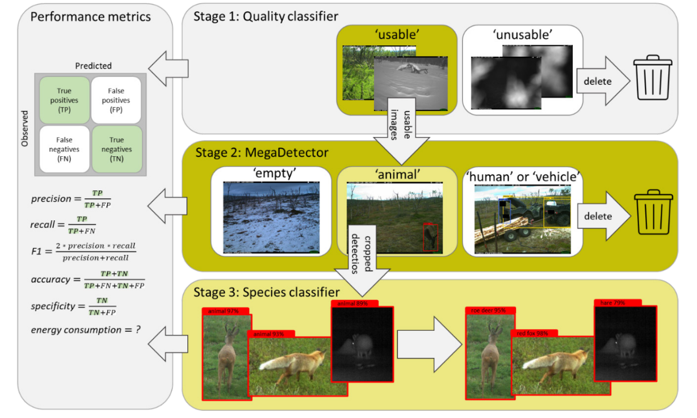

# ComVis: a cost-effective end-to-end pipeline for processing camera trap pictures at NINA

## Project ambition

The overall ambition of the project is to initiate a more efficient use of state-of-art machine learning tools,
that will streamline the processing of camera-based monitoring data in NINA. We will achieve this by
providing an end-to-end pipeline for processing of camera trap data based on a combination of an established
model (MegaDetector) and customized classifiers trained on data from NINAs monitoring programs.


## Implementation

The project is organised in four consecutive stages, where stages 1-3 are focused on methodological developments and stage 4 on documentation and reproducibility of the developments.

:warning: First of all, make sure to create the `Docker` image necessary to run the scripts:

```
git clone https://github.com/NINAnor/comvis.git
docker build -t comvis -f Dockerfile .
```

Alternatively you can use the repository without `Docker`, however given the amount of dependancies it may be tricker to install the necessary requirements. If you want to use the repository without `Docker` we recommand the use of `poetry` as package manager:

```bash
pip3 install poetry
poetry install 
```

### Stage 1: Image quality filtering
---

1. A trained classifier which separates images into two classes;
‘unusable’ and ‘usable’.
2. Performance statistics of the classifier.
3. A set of ‘usable’ images for each case for use in Stage 2.

### Stage 2: Image target filtering with MegaDetector

1. A detection of the ‘usable’ sample for each case into the
four MegaDetector classes; ‘empty’, ‘animal’, ‘human’ and
‘vehicle’.
2. Performance statistics of the detector.
3. Cropped image sections of all animal objects detected by
MegaDetector for use in Stage 3.

### Stage 3: Stage 3. Species-level annotation and identification

1. A trained classifier which classifies cropped image sections of
animal objects to species for selected cases.
2. Performance statistics of the classifier.

### Summary ComVis' workflow

<p align="center"></p>
