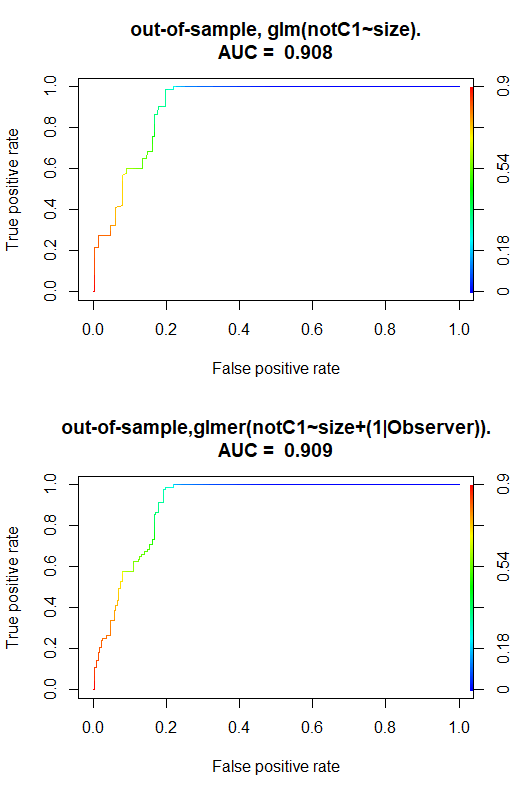

# Stage 1 results

The first stage was to quality filter the images. We compared the results of an algorithm with scores given by the project participants. We selected 80 images (20 per projects) of various quality and asked the project participants to give it a score ranging from 1 to 5 defined as follow:

1. **Clearly un-useable**: The image quality is very low and objects will certainly go undetected.
2. **Likely un-useable**: The image quality is low and objects are likely to go undetected in all or most of the image frame.
3. **Likely useable**: The image quality is low, but objects are likely to be detected.
4. **Useable**: The image quality is high and objects are likely to be detected.
5. **Clearly useable**: The image quality is very high and objects are highly likely to be detected.

For some examples see [the guideline document](../../assets/Quality%20score.pdf).

Using a multivariate model we estimated whether an observer effect exists. Results are displayed by the figure below.

We compared the size of the images and results from Laplace XXX (Francesco will know) to participants score to assess whether there is a correlation and estimate if a simple filtering algorithm can automatically filter out the bad quality pictures.

The figure below shows the correlation between the scores given by the participants (C1, C2, C3, C4 and C5) and the size of the image.

We can see that the images with a very small size (i.e. containing low amount of information) are unlikely to be given a high score while images with a larger size (i.e. containing more information) are likely to be given a high score.

In addition, we have run a logistic regression model (both with (glmer) and without (glm) observer ID included as a random factor). This is based on the logic that a user may often only be interested in how well the standardized image size is able to tell apart the really poor images from the rest. We developed the model using 80% of all the manual scores as training data and kept 20% for testing out-of-sample performance. In both datasets 0’s (= usable) constitute 75% and 1’s (=un-usable) 25%. The purpose of the exercise is to illustrate the trade-off between the wish to increase the TPR further towards 1 (get rid of all unusable images), without losing too many usable images from the sample (in the form of an increasing FPR)

-	When we only try to tell apart the worst class from the rest there is no observer effect (indicated also by attached ROC curves, the glm and the glmer produce ~the same results). This is in contrast to the nominal model where the effect of including observer ID as a random factor was significant. I guess this only means that observer disagreement is not so much related to identifying the really poor images, so it is expected.
-	There is very little gain from including any other co-variates from the Laplace (var_kx, max_kx) in addition to the standardized image size.
-	As shown by the attached ROC curves, in the present image set, we can increase the default TPR from 0.25 to about 0.5 if we accept to lose ~10% of usable images (FPR=0.1). However, getting rid of all unusable images (TPR=1.0) cannot be done without accepting a FPR of close to 0.3
-	Not included in the script, but it follows logically, that if we define “unusable” as the two lowest classes (“clearly unusable” and “likely unusable” all considered “unusable”), then the model does much worse, and we begin to see a bit of an observer effect as well. 
